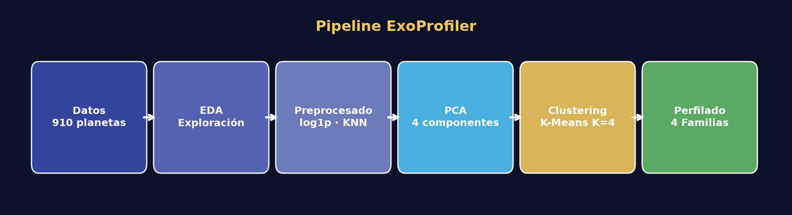
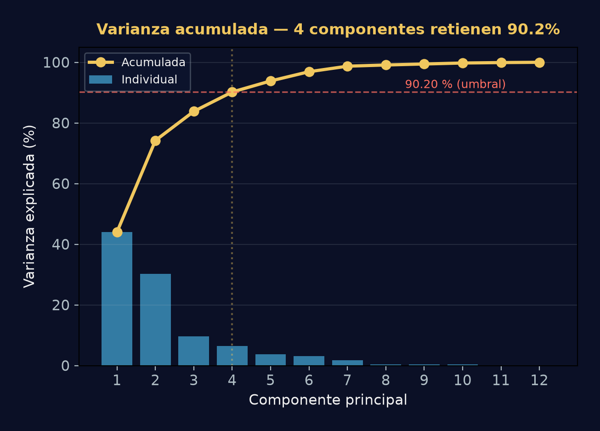
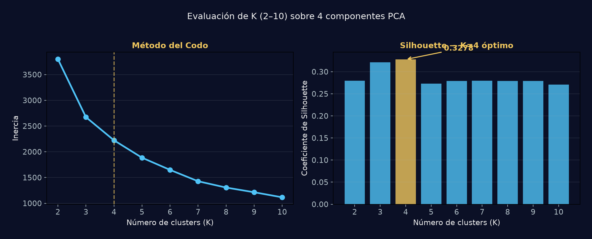
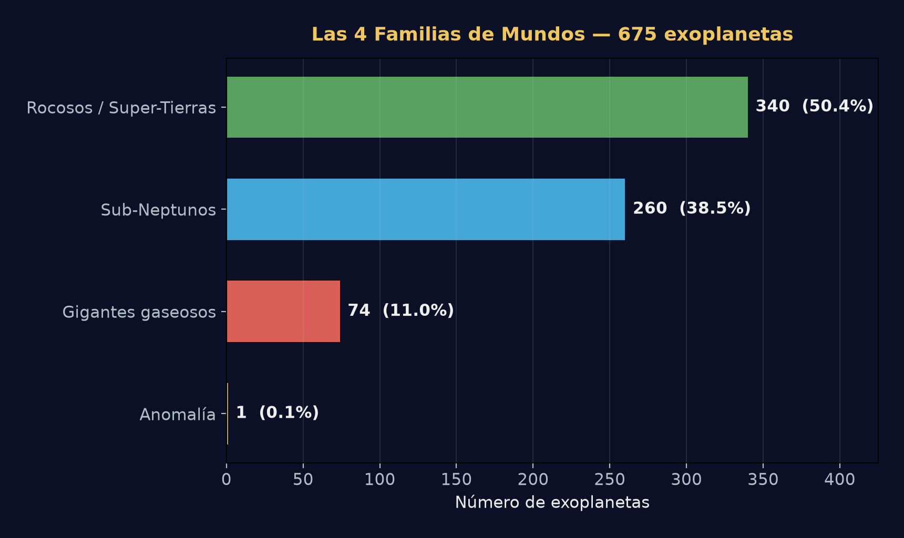
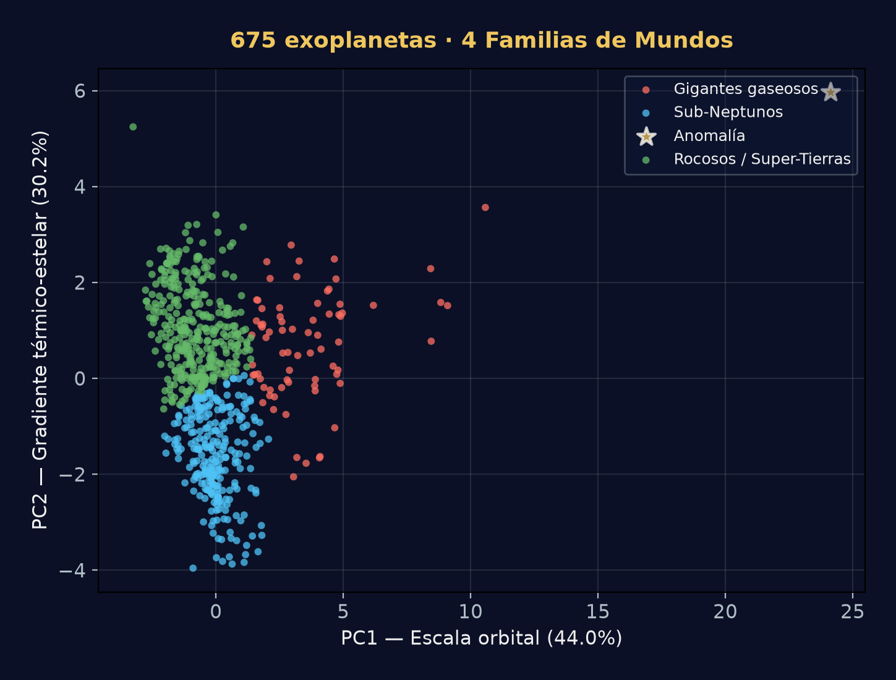

<p align="center">
  
</p>

<h1 align="center">🌌 ExoProfiler</h1>
<p align="center">
  <b>Descubrimiento Inteligente de Familias de Exoplanetas mediante Machine Learning No Supervisado</b>
</p>

<p align="center">
  <a href="https://exoplanet-profiler.streamlit.app/" target="_blank">
    
  </a>
</p>
<p align="center">
  
  
  
  
  
  
</p>

---

## 🎯 Objetivo

La exploración espacial genera enormes cantidades de datos sobre planetas situados fuera de nuestro Sistema Solar. ExoProfiler analiza las características físicas, orbitales y estelares de **675 exoplanetas reales** mediante técnicas de **reducción de dimensionalidad (PCA)** y **clustering (K-Means)** para:

- 🔍 Descubrir agrupaciones naturales sin categorías predefinidas
- 🏷️ Perfilar cada grupo como una **Familia de Mundos** interpretable
- 🌡️ Identificar las variables que definen cada familia
- ⚡ Detectar exoplanetas anómalos de interés científico

> **Resultado principal:** El modelo identificó automáticamente **4 familias de mundos** con una separación de Silhouette de **0.3278**, explicando el **90.2%** de la varianza total con solo 4 componentes principales.

## 🚀 App Interactiva
Explora los resultados del modelo y analiza el perfil de diferentes exoplanetas directamente en nuestra aplicación en la nube:
👉 **[Abrir ExoProfiler en Streamlit](https://exoplanet-profiler.streamlit.app/)**

---

## 📊 Dataset

| Atributo | Valor |
|:---|:---|
| **Fuente** | [NASA Exoplanet Archive — Planetary Systems](https://exoplanetarchive.ipac.caltech.edu/) |
| **Registros originales** | 910 exoplanetas |
| **Registros utilizados** | 675 (tras filtro temporal ≤ 2025 y completitud mínima de 8/12 features) |
| **Variables planetarias** | `pl_orbper`, `pl_orbsmax`, `pl_rade`, `pl_bmasse`, `pl_orbeccen`, `pl_insol`, `pl_eqt` |
| **Variables estelares** | `st_teff`, `st_rad`, `st_mass`, `st_met`, `st_logg` |
| **Total features** | 12 (7 planetarias + 5 estelares) |

<details>
<summary>📥 <b>Cómo descargar el dataset</b></summary>

1. Accede a la tabla **Planetary Systems** en el [NASA Exoplanet Archive](https://exoplanetarchive.ipac.caltech.edu/).
2. Marca (check) las columnas necesarias para el análisis.
3. Haz clic en el botón **Download**.
4. Selecciona **CSV Format**.
5. Elige **Download Currently Checked Columns**.
6. Elige **Download All Rows**.
7. Guarda el archivo como `data/raw/exoplanets.csv`.

</details>

---

## 🔬 Metodología

El proyecto sigue un pipeline de 6 etapas secuenciales, documentadas en notebooks individuales:

| Fase | Notebook | Descripción |
|:---|:---|:---|
| **1. Comprensión** | `01_data_understanding.ipynb` | Análisis de tipos de datos, valores nulos, distribuciones y correlaciones iniciales |
| **2. Exploración** | `02_eda.ipynb` | Análisis exploratorio profundo: outliers, distribuciones por variable, relaciones bivariadas |
| **3. Preprocesamiento** | `03_preprocessing.ipynb` | Filtro temporal (≤ 2025), selección de 12 features, transformación `log1p` en 6 variables sesgadas, imputación `KNNImputer` (k=5, ponderado por distancia), escalado `RobustScaler` |
| **4. PCA** | `04_pca_and_cluster_profiling.ipynb` | Reducción a 4 componentes (90.2% varianza retenida), análisis de loadings e interpretación de ejes |
| **5. Clustering** | `05_clustering_and_evaluation.ipynb` | K-Means (K=2..10), selección de K=4 por Codo + Silhouette (0.3278), asignación de familias |
| **6. Visualización** | `06_visualizaciones_presentacion.ipynb` | Generación de gráficos finales a partir de los CSV procesados |

<details>
<summary>🧮 <b>Detalle técnico del preprocesamiento</b></summary>

**Transformaciones aplicadas:**
- **Log1p** (6 variables con distribución sesgada): `pl_orbper`, `pl_orbsmax`, `pl_rade`, `pl_bmasse`, `pl_insol`, `st_rad`
- **Lineal** (6 variables con distribución más simétrica): `pl_orbeccen`, `pl_eqt`, `st_teff`, `st_mass`, `st_met`, `st_logg`

**Tratamiento de nulos:**
- Se exige un mínimo de **8 de 12 features** presentes por planeta (filtro de completitud)
- Los valores restantes se imputan con `KNNImputer(n_neighbors=5, weights='distance')`

**Tratamiento de outliers:**
- Política de **preservación**: Los outliers astronómicos son datos reales, no errores
- Mitigación mediante `log1p` (compresión de colas) + `RobustScaler` (resistente a extremos)

**Balance de filas:**

| Etapa | Planetas |
|:---|---:|
| Dataset original (NASA) | 910 |
| Excluidos por año > 2025 | −171 |
| Elegibles (≤ 2025) | 739 |
| Excluidos por completitud < 8/12 | −64 |
| **Retenidos para modelado** | **675** |

</details>

---

## 📈 Resultados Clave

### 1 · Varianza Explicada (PCA)

<p align="center">
  
</p>

> Los primeros **4 componentes principales** capturan el **90.2% de la varianza acumulada** del dataset, permitiendo reducir 12 variables originales a un espacio tetradimensional sin pérdida significativa de información.

| Componente | Varianza individual | Varianza acumulada | Interpretación física |
|:---:|---:|---:|:---|
| PC1 | 44.0% | 44.0% | **Escala orbital** — domina `pl_orbsmax` (0.81), `pl_orbper` (0.38) |
| PC2 | 30.2% | 74.2% | **Gradiente térmico-estelar** — domina `st_logg` (0.45), `st_rad` (−0.41) |
| PC3 | 9.6% | 83.8% | **Excentricidad orbital** — domina `pl_orbeccen` (0.95) |
| PC4 | 6.4% | 90.2% | **Metalicidad estelar** — domina `st_met` (0.81) |

---

### 2 · Evaluación del K Óptimo

<p align="center">
  
</p>

> Se evaluaron valores de K desde 2 hasta 10 para seleccionar el número óptimo de clusters.
>
> - **Método del Codo (izquierda):** La curva de inercia muestra un punto de inflexión claro en **K=4**.
> - **Silhouette (derecha):** El coeficiente alcanza su máximo en **K=4** con una puntuación de **0.3278**, confirmando que 4 clusters logran el mejor equilibrio entre cohesión interna y separación entre grupos.

---

### 3 · Las 4 Familias de Mundos

<p align="center">
  
</p>

| Cluster | Familia | Planetas | % del total | Perfil predominante |
|:---:|:---|---:|---:|:---|
| 0 | 🔴 **Gigantes Gaseosos** | 74 | 11.0% | Gran masa, órbitas amplias, altas temperaturas estelares |
| 1 | 🔵 **Sub-Neptunos / Neptunos Fríos** | 260 | 38.5% | Tamaño intermedio, órbitas cortas-medias, estrellas más frías |
| 2 | ⭐ **Anomalía Extrema** | 1 | 0.1% | Valores extremos en escala orbital (PC1) y gradiente térmico (PC2) |
| 3 | 🟢 **Rocosos / Super-Tierras** | 340 | 50.4% | Menor radio y masa, órbitas compactas, estrellas enanas |

---

### 4 · Distribución en Espacio PCA

<p align="center">
  
</p>

> Proyección de los 675 exoplanetas sobre los dos primeros componentes principales (74.2% de varianza combinada). La separación espacial entre los Gigantes Gaseosos (rojo), Sub-Neptunos (cian), y Rocosos/Super-Tierras (verde) valida la estructura robusta encontrada por K-Means. La estrella dorada marca el único planeta clasificado como anomalía extrema.

---

## ⚖️ Consideraciones Éticas y Limitaciones

### Sesgos observacionales

Los datos del NASA Exoplanet Archive están condicionados por los **métodos de detección** empleados para descubrir cada planeta. Esto introduce sesgos sistemáticos que el modelo hereda:

- **Método de tránsito** (mayoría de detecciones): Favorece la detección de planetas con órbitas cortas y tamaños grandes respecto a su estrella, subrepresentando planetas pequeños, lejanos o con órbitas inclinadas.
- **Velocidad radial**: Favorece planetas masivos cercanos a su estrella. Planetas de baja masa o con períodos muy largos quedan subdetectados.
- **Imagen directa**: Solo viable para planetas muy jóvenes, masivos y alejados de su estrella, lo que sesga hacia una fracción muy específica de la población real.

Como consecuencia, las 4 familias descubiertas reflejan la **estructura de los datos disponibles**, no necesariamente la distribución real del universo de exoplanetas.

### Limitaciones del modelado

| Limitación | Impacto | Mitigación aplicada |
|:---|:---|:---|
| **Valores ausentes** | Algunas features no están medidas en todos los planetas | `KNNImputer` (k=5, distancia ponderada) — introduce aproximación estadística que puede suavizar valores extremos reales |
| **Distribuciones sesgadas** | Variables como masa y período orbital tienen distribuciones de cola larga | Transformación `log1p` antes del escalado para comprimir rangos extremos |
| **K-Means asume clusters esféricos** | Los datos astrofísicos pueden tener formas irregulares | Se evaluó DBSCAN como alternativa, pero K-Means obtuvo mejor Silhouette en este dataset |
| **Reducción dimensional** | PCA es lineal; relaciones no lineales pueden perderse | Se retiene el 90.2% de varianza; se analizaron loadings para validar coherencia física |

### Interpretabilidad

> ⚠️ **Las familias descubiertas son agrupaciones estadísticas**, no categorías taxonómicas oficiales. Representan patrones matemáticos encontrados en los datos y deben interpretarse como hipótesis de trabajo, no como clasificaciones astronómicas definitivas.

La nomenclatura asignada a cada familia (Rocosos, Sub-Neptunos, Gigantes Gaseosos, Anomalía) se basa en la **interpretación de los perfiles medios** de cada cluster, buscando coherencia con la literatura exoplanetaria existente, pero sin pretender sustituir a las clasificaciones formales de la comunidad científica.

---

<details>
<summary><b>🛠️ Instalación y Reproducibilidad</b></summary>

### Requisitos
python ≥ 3.10
```
pandas
numPy
matplotlib
seaborn
scikit-learn
plotly
streamlit
jupyter
```

### Instalación
```bash
git clone https://github.com/tu-usuario/exoplanet-profiler.git
cd exoplanet-profiler
pip install -r requirements.txt
```

### Ejecución
Ejecuta los notebooks en orden secuencial (01 → 06):
```bash
jupyter notebook notebooks/
```

Cada notebook genera los artefactos intermedios que consume el siguiente. Los datos procesados se almacenan en `data/processed/`.

</details>

<details>
<summary><b>📂 Estructura del Proyecto</b></summary>

```text
exoplanet-profiler/
│
├── data/
│   ├── raw/                          # Dataset original (NASA CSV)
│   └── processed/                    # Datos limpios, scores PCA, clusters
│       ├── exoplanets_preprocessed.csv
│       ├── clustered_exoplanets.csv
│       ├── preprocessing_metadata.json
│       ├── preprocessing_pipeline.joblib
│       └── pca/
│           ├── pca_explained_variance.csv
│           ├── pca_loadings.csv
│           ├── pca_scores.csv
│           └── pca_model.joblib
│
├── notebooks/
│   ├── 01_data_understanding.ipynb   # Comprensión de datos
│   ├── 02_eda.ipynb                  # Análisis exploratorio
│   ├── 03_preprocessing.ipynb        # Limpieza y transformación
│   ├── 04_pca_and_cluster_profiling.ipynb  # PCA y perfilado
│   ├── 05_clustering_and_evaluation.ipynb  # K-Means y evaluación
│   └── 06_visualizaciones_presentacion.ipynb  # Gráficos finales
│
├── src/
│   ├── __init__.py
│   ├── preprocessing.py              # Funciones de preprocesamiento
│   ├── clustering.py                 # Funciones de clustering
│   └── visualization.py              # Funciones de visualización
│
├── app/
│   └── app.py                        # Prototipo interactivo (Streamlit)
│
├── assets/                           # Gráficos exportados (PNG)
├── entrega/                          # Presentación ejecutiva (PPTX + DOCX)
├── docs/                             # Guías técnicas de notebooks
├── requirements.txt
└── README.md
```

</details>

<details>
<summary><b>👥 Equipo</b></summary>

Proyecto desarrollado por:
- [Laura](https://github.com/LauraSilRu) - Product Owner
- [Elena](https://github.com/elenacarino-max) - Scrum Master
- [Elena D.](https://github.com/HelenDiMo)
- [Jose](https://github.com/GregDev08)
- [Elizabeth](https://github.com/adryeli)

</details>

---

<p align="center">
  <sub>Proyecto académico · Bootcamp IA & Big Data · Módulo 3 — Machine Learning No Supervisado</sub>
</p>
